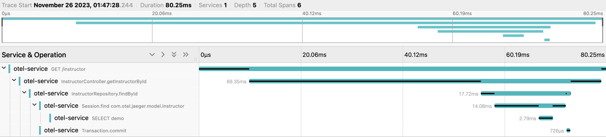
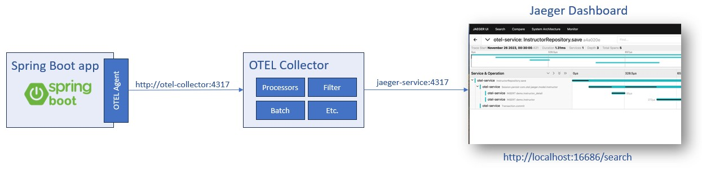

# spring-boot-otel-jaeger
## Introduction
In contemporary software development, microservices architecture has emerged as a widely adopted approach. It offers benefits such as seamless scalability, fault isolation, and support for language-agnostic programming. However, the division of services into smaller units, each deployed in distinct environments, comes with its challenges. Coordinating services to collaborate in response to a client's action can be complex, especially when delays in one service can impact others. This raises important questions: How can we effectively monitor these services? How can we gain insights into the time each service consumes?

To address these inquiries, I delved into research to identify the common tools and frameworks used for tracing. Therefore, in this article, I will undertake a small POC to delve into the tracing of a microservice using OpenTelemetry and Jaeger.

## Tracing
<p align="center">
  
</p>

tracing becomes crucial to understand how different services interact with each other to fulfill a user request. Tracing tools provide a detailed view of the end-to-end journey of a request, showing which services were involved, how much time each service took, and if there were any errors or delays.

## OpenTelemetry (OTEL)
is a versatile observability framework, providing APIs, libraries, and agents for streamlined instrumentation in cloud-native environments. Supporting multiple languages, it simplifies tracing, metrics, and logging, ensuring detailed performance data capture for effective monitoring and troubleshooting.\
In this scenario, we're going to focus on tracing only, and we will setup components for tracing at the following
>`OTEL Agent`: Streamlines the integration of OpenTelemetry instrumentation into applications, automating the collection and export of telemetry data, including traces and metrics.

>`OTEL Collector`: A versatile hub that receives, processes, and exports telemetry data. Configurable to support different input/output protocols, enhancing observability across various environments.


## Jaeger
Jaeger is an open-source distributed tracing system, part of the CNCF, designed to track transactions across microservices. With its user-friendly interface and compatibility with various backends, Jaeger visualizes and analyzes latency, making it a crucial tool for identifying bottlenecks and optimizing user experiences.

## Components
<p align="center">
  
</p>

As depicted in the illustration above, there are three key components that require configuration: OTEL Agent, OTEL Collector, and Jaeger. I'll provide more detailed insights into each of these components in the upcoming section. Additionally, it's worth noting that the communication between these components is facilitated through the use of port 4317, a valid port for OTLP/gRPC.

### 1.Agent configuration
#### Instrumentation
In order to make a system observable, it must be instrumented. That is, code from the system’s components must emit traces, metrics, and logs.
The instruments differ in three ways, as shown below.

>`Automatic Instrumentation`: is the most straightforward method, requiring no source code modifications. Simply download an agent and provide a few parameters when starting the application.

>`Manually Instrumentation`:  requires to add code snippets for tracing, metrics, and logging within the application code. Developers have fine-grained control over what and how instrumentation is implemented. 

>`Instrumentation Libraries`: for libraries without such an integration the OpenTelemetry.

Refer document : [Instrumentation](https://opentelemetry.io/docs/concepts/instrumentation/)
```diff
- Note: some of your libraries will be observable out of the box by calling the OpenTelemetry API themselves directly. Those libraries are sometimes called `natively instrumented`.
```

In this article, I'm going to use `Automatic Instrumentation` with the Spring Boot application, which has a detailed configuration. Please see below:
#### Automatic Instrumentation Configuration
1. Setup enivronment at following 
 ```
export OTEL_SERVICE_NAME="your-service-name"
export OTEL_EXPORTER_OTPL_ENDPOINT=http://your-collector-service:4317
export OTEL_METRICS_EXPORTER=none
 ```
OTEL_SERVICE_NAME: Sets the service name visible on the Jaeger dashboard.
OTEL_EXPORTER_OTPL_ENDPOINT: Specifies the endpoint for OpenTelemetry data. Useful when pointing to an OTEL Collector in a Docker or external setup.
OTEL_METRICS_EXPORTER=none: Disables metrics export. Running the application without this may trigger a warning message.

2. Start Spring boot app with agent 
 ```java
java -javaagent:path/to/opentelemetry-javaagent.jar -jar myapp.jar

 ```
Refer document:\
[Automatic Instrumentation](https://opentelemetry.io/docs/instrumentation/java/automatic/)\
[OpenTelemetry Protocol Exporter](https://opentelemetry.io/docs/specs/otel/protocol/exporter/)


| Section   | Purpose                                                           | Example                                                                                                              |
|-----------|-------------------------------------------------------------------|----------------------------------------------------------------------------------------------------------------------|
| Receivers | Configure receivers that listen for incoming data.               | - `otlp`: OTLP receiver for traces over gRPC.<br/> - `otlp/standalone`: OTLP receiver for metrics.<br/> - `zipkin`: Zipkin receiver for traces over HTTP.                       |
| Exporters | Configure exporters that send data to external systems.          | - `logging`: Logging Exporter for traces and metrics to the console. Useful for testing.                               |
| Processors| Configure processors that manipulate or transform data.          | - `batch`: Batch Processor to batch traces and metrics before exporting, reducing network overhead.                  |
| Extensions| Configure extensions providing additional functionality.          | - `health_check`: Health Check extension with a health check endpoint.<br/> - `zpages`: ZPages extension for web interface for debugging traces.                        |
| Service   | Define pipelines specifying how data flows through the collector.| - `pipelines`: Separate pipelines for traces, metrics, and logs.<br/> - `traces`: Trace pipeline with OTLP receiver and Logging Exporter.<br/> - `metrics`: Metrics pipeline with OTLP/standalone receiver and Logging Exporter.<br/> - `logs`: Logs pipeline with Zipkin receiver, Batch Processor, and Logging Exporter. |
